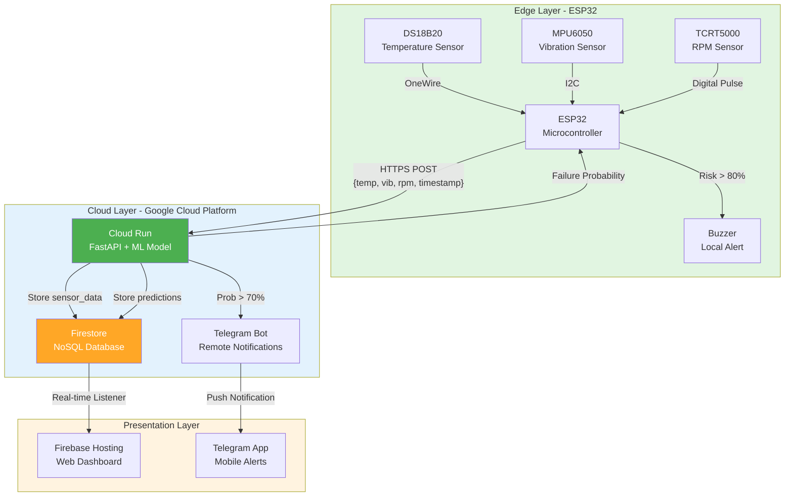

# Technical Report: Smart City Motor Health Monitoring System
**Course:** CPC357 - IoT & Cloud Computing
**Project:** Smart City Motor Health Monitoring System
**Date:** December 17, 2025

---

## 1.0 Problem Statement
Industrial motors are the workhorses of urban infrastructure, powering everything from water treatment pumps to subway ventilation fans. However, they commonly experience failures due to overheating, excessive vibration, or unstable rotational speed. These mechanical faults often develop gradually, but traditional "run-to-failure" or scheduled maintenance approaches are inefficient. Manual inspections are infrequent and hazardous, often failing to identify early warning signs. Consequently, sudden breakdowns lead to costly downtime, service disruptions, and safety risks. Therefore, a low-cost IoT and machine learning system is required to continuously monitor motor condition, analyze patterns, and predict potential failures before they occur, transitioning maintenance from reactive to proactive.

## 2.0 Objectives
The primary goal is to develop a robust prototype that demonstrates the feasibility of remote, predictive maintenance.
1.  **Monitor Motor Health**: continuously measure critical parameters (temperature, vibration, and RPM) using the ESP32 microcontroller with high sampling precision.
2.  **Predict Failures**: Leverage cloud computing (**Google Cloud Run**) to execute machine learning models that detect anomalies and calculate failure probability in real-time.
3.  **Real-time Visualization**: Centralize data storage in **Google Firestore** and visualize live telemetry via a responsive web dashboard for remote decision-making.
4.  **Local & Remote Alerts**: Trigger immediate local warnings (buzzer) and remote notifications (Telegram) when abnormal behavior is detected to ensure rapid response.

---

## 3.0 Components Used

### 3.1 Microcontroller & Edge Processor
1.  **ESP32 NodeMCU** [1]: Selected for its dual-core Tensilica Xtensa LX6 processor (up to 240 MHz) and built-in Wi-Fi 802.11 b/g/n capabilities. It acts as the edge gateway, collecting raw sensor data, performing pre-processing (like vibration RMS calculation) to reduce bandwidth, and securely transmitting JSON payloads via HTTPS.
2.  **Google Cloud Run (Serverless)** [2]: A fully managed, containerized environment hosting the Python FastAPI backend. It replaces the need for a local Raspberry Pi by shifting the heavy ML inference workload to the cloud, ensuring high availability, automatic scaling, and zero maintenance overhead.

### 3.2 Motor Under Test
*   **Model**: 300C 1.5–6V DC Motor (from IoT Kit) with a 3-blade propeller.
*   **Purpose**: Acts as the physical plant for the simulation. It allows for the safe induction of faults—such as obstructing the fan (stall/RPM drop) or heating the casing (overheating)—to validate the system's detection capabilities.

---

## 4.0 Sensors

| Sensor | Detection Capability | Range & Specification | Usage in Project |
| :--- | :--- | :--- | :--- |
| **DS18B20** (Temperature) [3] | Detects thermal runaway and friction-induced heat. | **Range:** -55°C to +125°C<br>**Accuracy:** ±0.5°C (-10°C to +85°C)<br>**Protocol:** OneWire (1-Wire®)<br>**Resolution:** 9-12 bits programmable | Attached to the motor casing to monitor operating temperature deviations. |
| **MPU6050** (Vibration) [4] | Measures mechanical instability and structural looseness. | **Accel Range:** ±2g to ±16g<br>**Gyro Range:** ±250 to ±2000 °/s<br>**Precision:** 16-bit ADC<br>**Interface:** I²C | Mounted rigidly to the motor base. Calculates Root Mean Square (RMS) acceleration to detect abnormal vibrations. |
| **TCRT5000** (RPM/IR) [5] | Detects rotational speed and stall conditions. | **Range:** 0.2mm to 15mm (optimal 2.5mm)<br>**Type:** Reflective IR (950nm)<br>**Output:** Digital Pulse<br>**Operating Voltage:** 5V | Placed near the spinning propeller to count rotations per minute, detecting load changes or power failures. |

---

## 5.0 Actuators

### 5.1 Local Alert - Active Buzzer
A simple piezoelectric buzzer connected to a GPIO pin. It provides immediate audible feedback to on-site personnel when the cloud API returns a "High Risk" status (>80% probability), ensuring safety even if the dashboard is not being watched.

### 5.2 Remote Alert - Telegram Notifications
A cloud-based notification system that delivers real-time alerts to maintenance teams via Telegram messaging platform.

**Configuration:**
- **Bot Setup**: Created via Telegram's @BotFather to obtain API token
- **Group Chat Integration**: Bot added to a dedicated maintenance group to enable team-wide alerts
- **Alert Threshold**: Automatically triggered when failure probability exceeds **70%**
- **Deployment**: Token and Chat ID securely stored as environment variables in Cloud Run (`env.yaml`)

**Alert Message Format:**
```
🚨 CRITICAL WARNING: Motor Failure Detected 🚨

⏰ Time: 2025-12-18 01:30:45
⚠️ Failure Probability: 95.3%

📊 Sensor Readings:
• Temperature: 68.5 °C
• Vibration: 0.112 m/s²
• RPM: 1287

Please check the equipment immediately!
```

**Benefits:**
- 24/7 remote monitoring without requiring dashboard access
- Multi-user notification for team coordination
- Immediate mobile alerts for rapid response
- Historical message log for incident tracking

---

## 6.0 System Architecture

The system follows a distributed IoT architecture with edge processing, cloud inference, and real-time data synchronization:



**Data Flow Steps:**
1. **Sensor Acquisition** (1 Hz): ESP32 reads temperature, vibration (RMS), and RPM
2. **Edge Transmission**: JSON payload sent via secure HTTPS to Cloud Run endpoint `/predict`
3. **ML Inference**: Logistic regression model computes failure probability (0.0–1.0)
4. **Data Persistence**: Results stored in Firestore collections (`sensor_data`, `predictions`)
5. **Alert Distribution**:
   - Local: Buzzer activated if probability > 80%
   - Remote: Telegram message sent if probability > 70%
6. **Real-time Visualization**: Dashboard subscribes to Firestore changes and updates charts instantly

---

## 6.0 Machine Learning Approach

### 6.1 Synthetic Data for Training
Since inducing catastrophic failure in a small prototype motor is difficult and destructive, a synthetic dataset was generated to train the model. This dataset models:
1.  **Normal Operation**: Low vibration, stable RPM, ambient temperature.
2.  **Overheating**: Gradual temperature ramp-up with normal vibration.
3.  **Unbalance/Loose**: High vibration spikes with unstable RPM.
4.  **Stall**: Zero or low RPM with rising temperature.

### 6.2 Model Selection & Logic
*   **Model Architecture**: A Logistic Regression classifier from scikit-learn [6] was chosen for its interpretability, computational efficiency, and proven effectiveness in binary classification tasks. It outputs a continuous probability score (0.0 to 1.0) rather than a binary class, allowing for nuanced risk levels.
*   **Deployment**: The model is serialized using Python's `pickle` module and loaded into the FastAPI [7] container on Cloud Run, enabling sub-second inference times.
*   **Inference Flow**: `Input Vector [Temp, Vib_RMS, RPM]` → `Logistic Regression Model` → `Failure Probability`.

---

## 7.0 Cloud Dashboard and Data Storage
**Google Firebase** [8] provides a unified platform for the real-time app layer, chosen for its seamless integration with Google Cloud services and real-time synchronization capabilities.

### 7.1 Dashboard Features
1.  **Live Monitoring**: Multi-line charts using Chart.js [9] update instantly via Firestore real-time listeners, effectively showing the "heartbeat" of the machine.
2.  **Risk Assessment**: A color-coded status indicator (Green=Safe, Yellow=Warning, Red=Critical) gives an at-a-glance health summary.
3.  **Data Persistence**: All readings are stored in Firestore [10] `sensor_data` collection, while predictions go to `predictions`, allowing for historical auditing and trend analysis.

### 7.2 Data Flow Pipeline
1.  **Acquisition**: ESP32 reads sensors every 1000ms.
2.  **Ingestion**: HTTPS POST request sent to Cloud Run endpoint `/predict`.
3.  **Processing**: Cloud Run computes risk and writes results to Firestore.
4.  **Presentation**: Dashboard subscribes to Firestore changes and renders new data points.

---

## 8.0 SDG 9 Impact Analysis
**Goal 9: Industry, Innovation and Infrastructure**

This project directly supports the modernization of industrial infrastructure:
*   **Target 9.4 (Sustainable Infrastructure)**: By retrofitting legacy motors with simple add-on sensors (using the retrofit concept), industries can extend the life of existing machinery rather than replacing it, promoting resource efficiency.
*   **Target 9.5 (Technological Upgrade)**: It demonstrates the application of cutting-edge Industry 4.0 technologies (Cloud AI, Edge Computing) in a practical, accessible manner, bridging the gap between theoretical research and industrial application.
*   **Resilience**: Predictive maintenance ensures that critical services (water, power, transport) face fewer interruptions, building a more resilient urban ecosystem.

---

## 9.0 Expected Outcomes
1.  **Functional Prototype**: A fully integrated hardware-software loop capable of continuous operation without manual intervention.
2.  **Accurate Anomaly Detection**: The system successfully identifies induced faults (heating, shaking, stopping) with high confidence.
3.  **Operational Dashboard**: A publicly accessible web URL displaying live telemetry with sub-second latency.
4.  **Proactive Safety**: Validated alert chain where a physical fault triggers a digital notification within seconds, proving the "Safety First" concept.

---

## 10.0 Links and Resources

### 10.1 Source Code Repository
*   **GitHub Link**: [INSERT YOUR GITHUB LINK HERE]

### 10.2 Demonstration Video
*   **YouTube Link**: [INSERT YOUR YOUTUBE VIDEO LINK HERE]

---

## 11.0 References

[1] Espressif Systems, "ESP32 Series Datasheet," Version 4.0, 2023. [Online]. Available: https://www.espressif.com/sites/default/files/documentation/esp32_datasheet_en.pdf

[2] Google Cloud, "Cloud Run Documentation - Serverless Container Platform," Google LLC, 2024. [Online]. Available: https://cloud.google.com/run/docs

[3] Analog Devices (Maxim Integrated), "DS18B20 Programmable Resolution 1-Wire Digital Thermometer," Datasheet, Rev. 7, 2019. [Online]. Available: https://www.analog.com/media/en/technical-documentation/data-sheets/DS18B20.pdf

[4] TDK InvenSense, "MPU-6000 and MPU-6050 Product Specification," Revision 3.4, 2013. [Online]. Available: https://invensense.tdk.com/wp-content/uploads/2015/02/MPU-6000-Datasheet1.pdf

[5] Vishay Semiconductors, "TCRT5000, TCRT5000L - Reflective Optical Sensor with Transistor Output," Document Number: 83751, Rev. 1.9, 2019. [Online]. Available: https://www.vishay.com/docs/83760/tcrt5000.pdf

[6] F. Pedregosa et al., "Scikit-learn: Machine Learning in Python," _Journal of Machine Learning Research_, vol. 12, pp. 2825–2830, 2011.

[7] S. Ramirez, "FastAPI framework, high performance, easy to learn, fast to code, ready for production," 2024. [Online]. Available: https://fastapi.tiangolo.com/

[8] Google Firebase, "Firebase Documentation - Build and Run Apps," Google LLC, 2024. [Online]. Available: https://firebase.google.com/docs

[9] Chart.js Contributors, "Chart.js - Simple yet flexible JavaScript charting library," Version 4.4, 2024. [Online]. Available: https://www.chartjs.org/

[10] Google Cloud, "Firestore Documentation - NoSQL Document Database," Google LLC, 2024. [Online]. Available: https://cloud.google.com/firestore/docs
*   **YouTube Link**: [INSERT YOUR YOUTUBE VIDEO LINK HERE]
