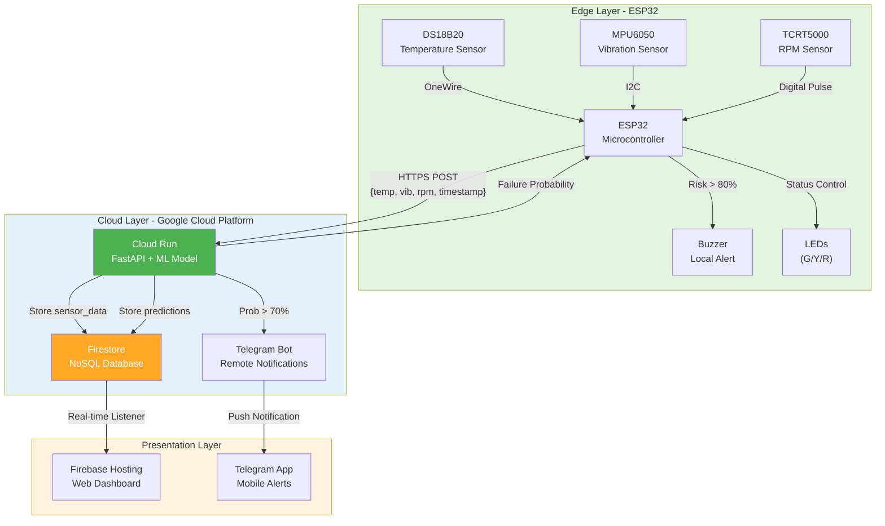

# Technical Report: Industrial Motor Health Monitoring System for SDG 9 Industry
**Course:** CPC357 - IoT & Cloud Computing
**Project:** Industrial Motor Health Monitoring System (SDG 9 Focus)
**Date:** December 18, 2025

---

## 1.0 Introduction

### 1.1 Problem Statement
Industrial motors are the workhorses of manufacturing plants and production lines, powering critical machinery from conveyor belts to heavy-duty compressors. However, they commonly experience failures due to overheating, excessive vibration, or unstable rotational speed, with bearing and stator faults accounting for over 70% of total failures [1]. These mechanical faults often develop gradually, but traditional "run-to-failure" or scheduled maintenance approaches are inefficient. In industrial settings, manual inspections are infrequent and hazardous, often failing to identify early warning signs. Consequently, sudden breakdowns lead to costly downtime, production halts, and safety risks. Therefore, a low-cost IoT and machine learning system is required to continuously monitor motor condition, analyze patterns, and predict potential failures before they occur, transitioning maintenance from reactive to proactive in line with modern Industry 4.0 standards [2].

### 1.2 Objectives
The primary goal is to develop a robust prototype that demonstrates the feasibility of remote, predictive maintenance.
1.  **Monitor Motor Health**: To continuously measure critical parameters (temperature, vibration, and RPM) using the ESP32 microcontroller with high sampling precision.
2.  **Predict Failures**: To leverage cloud computing (**Google Cloud Run**) to execute machine learning models that detect anomalies and calculate failure probability in real-time.
3.  **Real-time Visualization**: To centralize data storage in **Google Firestore** and visualize live telemetry via a responsive web dashboard for remote decision-making.
4.  **Local & Remote Alerts**: To trigger immediate local warnings (buzzer, **LEDs**) and remote notifications (Telegram) when abnormal behavior is detected to ensure rapid response.

### 1.3 SDG 9 Impact Analysis - Industry, Innovation and Infrastructure
This project is strategically aligned with **SDG 9: Industry, Innovation and Infrastructure**, specifically focusing on the modernization and sustainability of industrial processes [3].

#### Primary Target: 9.4 - Sustainable Infrastructure & Retrofitting
*   **Target Description**: By 2030, upgrade infrastructure and retrofit industries to make them sustainable, with increased resource-use efficiency and greater adoption of clean and environmentally sound technologies and industrial processes [3].
*   **Application in Project**: This system demonstrates a low-cost "retrofit" approach. By adding IoT sensors to existing legacy motors, industries can extend the lifespan of their equipment and improve operational efficiency without the need for total replacement. This promotes resource efficiency and reduces industrial waste.

#### Secondary Target: 9.5 - Technological Upgrade
*   **Target Description**: Enhance scientific research, upgrade the technological capabilities of industrial sectors in all countries [3].
*   **Application in Project**: It implements Industry 4.0 principles (Cloud AI, Edge Computing, and Real-time Analytics) in a practical way, providing a scalable model for technological advancement in manufacturing and industrial maintenance.

#### Resilience and Innovation
The predictive nature of the system ensures that industrial infrastructure remains resilient, minimizing downtime and ensuring steady production cycles, which is essential for economic growth and industrial stability.

---

## 2.0 Methodology & System Design

### 2.1 Hardware Components

#### Microcontroller & Edge Processor
**ESP32 NodeMCU** [4]: Selected for its dual-core Tensilica Xtensa LX6 processor (up to 240 MHz) and built-in Wi-Fi 802.11 b/g/n capabilities. It acts as the edge gateway, performing critical **edge pre-processing** before data transmission to reduce bandwidth and latency:
*   **Vibration Analysis**: Instead of streaming thousands of raw accelerometer points, the ESP32 captures a burst of **200 high-frequency samples** and calculates the Root Mean Square (RMS) locally. This condenses the "roughness" of the motor into a single floating-point value.
    ```cpp
    // Code Snapshot from esp32/main/main.ino
    for (int i = 0; i < VIB_SAMPLES; i++)
    {
      sensors_event_t accel, gyro, temp;
      mpu.getEvent(&accel, &gyro, &temp);

      // Calculate magnitude
      float a = sqrt(
          accel.acceleration.x * accel.acceleration.x +
          accel.acceleration.y * accel.acceleration.y +
          accel.acceleration.z * accel.acceleration.z);

      sum += a;
      sumSq += a * a;
      delayMicroseconds(VIB_DELAY_US);
    }
    // Calculate Standard Deviation (RMS)
    float mean = sum / VIB_SAMPLES;
    vibRMS = sqrt((sumSq / VIB_SAMPLES) - (mean * mean));
    ```

*   **RPM Calculation**: It utilizes a hardware interrupt to perform **continuous pulse counting** over a 5-second interval, averaging the speed into a precise Revolutions Per Minute (RPM) value.
    ```cpp
    // Code Snapshot from esp32/main/main.ino
    noInterrupts();
    unsigned long pulses = pulseCount; // Atomic read
    pulseCount = 0;
    interrupts();

    // Convert pulses to RPM
    rpm = (pulses * 60000.0f) / (float)elapsedMs;
    ```

*   **Thermal Monitoring**: It performs polling of the DS18B20 digital sensor to acquire the current casing temperature.
    ```cpp
    // Code Snapshot from esp32/main/main.ino
    DS18B20.requestTemperatures();
    float tempC = DS18B20.getTempCByIndex(0);
    ```

By aggregating these values into a lightweight JSON payload, the system minimizes cloud ingress costs and network usage.

#### Equipment Under Test (JOHNAS EDIT THIS)
*   **Device**: Electric Fan (Test Unit).
*   **Purpose**: Acts as the representative rotating machinery for the simulation. The setup involves:
    *   **Rotation**: The **TCRT5000 IR sensor** is positioned near the fan's blades to detect passage and calculate RPM.
    *   **Vibration**: The **MPU6050** is mounted on the fan's casing to measure the natural mechanical vibrations generated during operation.
    *   **Temperature**: The **DS18B20** is attached to the motor housing, with an **external heat source** (e.g., heat gun or hair dryer) used to simulate overheating conditions for testing purposes.

### 2.2 Sensors (JOHNAS CHECK THE USAGE, TJ CHECK THE SPECIFICATIONS)

| Sensor | Detection Capability | Range & Specification | Usage in Project |
| :--- | :--- | :--- | :--- |
| **DS18B20** (Temperature) [6] | Detects thermal runaway and friction-induced heat. | **Range:** -55°C to +125°C<br>**Accuracy:** ±0.5°C (-10°C to +85°C)<br>**Protocol:** OneWire (1-Wire®)<br>**Resolution:** 9-12 bits programmable | Attached to the motor casing to monitor operating temperature deviations. |
| **MPU6050** (Vibration) [7] | Measures mechanical instability and structural looseness. | **Accel Range:** ±2g to ±16g<br>**Gyro Range:** ±250 to ±2000 °/s<br>**Precision:** 16-bit ADC<br>**Interface:** I²C | Mounted rigidly to the motor base. Calculates Root Mean Square (RMS) acceleration to detect abnormal vibrations. |
| **TCRT5000** (RPM/IR) [8] | Detects rotational speed and stall conditions. | **Range:** 0.2mm to 15mm (optimal 2.5mm)<br>**Type:** Reflective IR (950nm)<br>**Output:** Digital Pulse<br>**Operating Voltage:** 5V | Placed near the spinning propeller to count rotations per minute, detecting load changes or power failures. |

### 2.3 Actuators

#### Local Alert - Active Buzzer
A simple piezoelectric buzzer connected to a GPIO pin. It provides immediate audible feedback to on-site personnel when the cloud API returns a "High Risk" status (>80% probability), ensuring safety even if the dashboard is not being watched.

#### Local Alert - Status LEDs
Three colored LEDs provide a visual indication of the real-time motor health status based on the failure probability calculated by the model:
*   **Green LED (Healthy)**: Indicates normal operation (Probability < 31%).
*   **Yellow LED (Warning)**: Indicates potential issues or accumulating stress (Probability 31% – 79%).
*   **Red LED (Critical Failure)**: Indicates high failure probability (> 80%), synchronized with the buzzer alert.

#### Remote Alert - Telegram Notifications
A cloud-based notification system that delivers real-time alerts to maintenance teams via Telegram messaging platform.

**Configuration:**
- **Bot Setup**: Created via Telegram's @BotFather to obtain API token
- **Group Chat Integration**: Bot added to a dedicated maintenance group to enable team-wide alerts
- **Alert Threshold**: Automatically triggered when failure probability exceeds **80%**
- **Deployment**: Token and Chat ID securely stored as environment variables in Cloud Run (`env.yaml`)

**Alert Message Format:**
```
🚨 CRITICAL WARNING: Motor Failure Detected 🚨

⏰ Time: 2025-12-18 01:30:45
⚠️ Failure Probability: 95.3%

📊 Sensor Readings:
• Temperature: 68.5 °C
• Vibration: 0.112 m/s²
• RPM: 1287

Please check the equipment immediately!
```

**Benefits:**
- 24/7 remote monitoring without requiring dashboard access
- Multi-user notification for team coordination
- Immediate mobile alerts for rapid response
- Historical message log for incident tracking

### 2.4 System Architecture (To draw and review)
The system follows a distributed IoT architecture with edge processing, cloud inference, and real-time data synchronization:



**Data Flow Steps:**
1. **Sensor Acquisition** (1 Hz): ESP32 reads temperature, vibration (RMS), and RPM
2. **Edge Transmission**: JSON payload sent via secure HTTPS to Cloud Run endpoint `/predict`
3. **ML Inference**: Random Forest model computes failure probability (0.0–1.0)
4. **Data Persistence**: Results stored in Firestore collections (`sensor_data`, `predictions`)
5.  **Alert Distribution**:
    - Local: Buzzer activated if probability > 80%; LEDs set to Green/Yellow/Red based on risk.
    - Remote: Telegram message sent if probability > 70%
6. **Real-time Visualization**: Dashboard subscribes to Firestore changes and updates charts instantly

---

## 3.0 System Implementation

### 3.1 Machine Learning Approach

#### Synthetic Data for Training
Since inducing catastrophic failure in a small prototype motor is difficult and destructive, a synthetic dataset was generated to train the model. This dataset models:
1.  **Normal Operation**: Low vibration, stable RPM, ambient temperature.
2.  **Overheating**: Gradual temperature ramp-up with normal vibration.
3.  **Unbalance/Loose**: High vibration spikes with unstable RPM.
4.  **Stall**: Zero or low RPM with rising temperature.

#### Model Selection & Logic
*   **Model Architecture**: A **RandomForestClassifier** from scikit-learn [9] was chosen for its ability to capture complex, non-linear relationships between features (e.g., how high temperature might be sustainable at high RPM but critical at low RPM).
*   **Reason for Choice**: Unlike linear models, Random Forest is robust against unscaled data and handles the interaction between vibration, temperature, and RPM more effectively without extensive feature engineering.
*   **Configuration**: The model is configured with `n_estimators=300` trees to ensure stability and reduce overfitting, with `random_state=42` for reproducibility.
*   **Deployment**: The model is serialized using Python's `pickle` module and loaded into the FastAPI [10] container on Cloud Run, enabling sub-second inference times.
*   **Inference Flow**: `Input Vector [Temp, Vib_RMS, RPM]` → `Random Forest Ensemble` → `Failure Probability`.

### 3.2 Cloud Implementation
The system leverages the Google Cloud Platform (GCP) ecosystem to ensure scalability, reliability, and ease of deployment.

#### Google Cloud Run (Compute & Inference)
Cloud Run is used to host the Python FastAPI backend and the Machine Learning model.
*   **Role**: Receives sensor data from ESP32, runs the Random Forest inference, and returns the failure probability.
*   **Why Chosen**:
    *   **Serverless**: Removes the need to manage infrastructure or OS updates (unlike a Virtual Machine or Raspberry Pi).
    *   **Containerized**: Uses Docker containers, ensuring the environment (Python dependencies) is consistent across development and production.
    *   **Auto-scaling**: Automatically scales down to zero when not in use to save costs, and scales up instantly when receiving requests.

#### Google Firestore (Database)
Firestore is a NoSQL document database used for storing time-series sensor data and prediction results.
*   **Role**: Persists every reading (`sensor_data` collection) and every inference result (`predictions` collection).
*   **Why Chosen**:
    *   **Real-time Synchronization**: Offers built-in listeners that push data updates to the client (Dashboard) instantly, eliminating the need for complex WebSocket or MQTT setups.
    *   **Flexible Schema**: The JSON document structure matches perfectly with the unstructured sensor data payloads.

#### Firebase Hosting (Presentation)
Firebase Hosting is used to serve the web dashboard (HTML/CSS/JS).
*   **Role**: Delivers the user interface to the client's browser.
*   **Why Chosen**:
    *   **Global CDN**: Serves content from edge locations close to the user for low latency.
    *   **Secure (SSL)**: Provides HTTPS out of the box, which is critical for secure industrial monitoring applications.
    *   **Integration**: Seamlessly accesses Firestore data using the Firebase SDK without needing a separate backend proxy.

---

## 4.0 Conclusion & Outcomes

### 4.1 Expected Outcomes
1.  **Functional Prototype**: A fully integrated hardware-software loop capable of continuous operation without manual intervention.
2.  **Accurate Anomaly Detection**: The system successfully identifies induced faults (heating, shaking, stopping) with high confidence.
3.  **Operational Dashboard**: A publicly accessible web URL displaying live telemetry with sub-second latency.
4.  **Proactive Safety**: Validated alert chain where a physical fault triggers a digital notification within seconds, proving the "Safety First" concept.

### 4.2 Links and Resources
*   **Source Code Repository**: [INSERT YOUR GITHUB LINK HERE]
*   **Demonstration Video**: [INSERT YOUR YOUTUBE VIDEO LINK HERE]

---

## 5.0 References

[1] S. Nandi, H. A. Toliyat and X. Li, "Condition Monitoring and Fault Diagnosis of Electrical Machines—A Review," IEEE Transactions on Energy Conversion, vol. 20, no. 4, pp. 719-729, Dec. 2005. [Online]. Available: https://ieeexplore.ieee.org/document/1542306

[2] J. Z. Sikorska, M. Hodkiewicz and L. Ma, "Prognostic modelling options for remaining useful life estimation by industry," Mechanical Systems and Signal Processing, vol. 25, no. 5, pp. 1803-1836, 2011. [Online]. Available: https://doi.org/10.1016/j.ymssp.2010.11.018

[3] UN Department of Economic and Social Affairs, "Goal 9 | Department of Economic and Social Affairs," United Nations, 2024. [Online]. Available: https://sdgs.un.org/goals/goal9

[4] Espressif Systems, "ESP32 Series Datasheet," Version 4.0, 2023. [Online]. Available: https://www.espressif.com/sites/default/files/documentation/esp32_datasheet_en.pdf

[5] Google Cloud, "Cloud Run Documentation - Serverless Container Platform," Google LLC, 2024. [Online]. Available: https://cloud.google.com/run/docs

[6] Analog Devices (Maxim Integrated), "DS18B20 Programmable Resolution 1-Wire Digital Thermometer," Datasheet, Rev. 7, 2019. [Online]. Available: https://www.analog.com/media/en/technical-documentation/data-sheets/DS18B20.pdf

[7] TDK InvenSense, "MPU-6000 and MPU-6050 Product Specification," Revision 3.4, 2013. [Online]. Available: https://invensense.tdk.com/wp-content/uploads/2015/02/MPU-6000-Datasheet1.pdf

[8] Vishay Semiconductors, "TCRT5000, TCRT5000L - Reflective Optical Sensor with Transistor Output," Document Number: 83751, Rev. 1.9, 2019. [Online]. Available: https://www.vishay.com/docs/83760/tcrt5000.pdf

[9] F. Pedregosa et al., "Scikit-learn: Machine Learning in Python," _Journal of Machine Learning Research_, vol. 12, pp. 2825–2830, 2011.

[10] S. Ramirez, "FastAPI framework, high performance, easy to learn, fast to code, ready for production," 2024. [Online]. Available: https://fastapi.tiangolo.com/

[11] Google Firebase, "Firebase Documentation - Build and Run Apps," Google LLC, 2024. [Online]. Available: https://firebase.google.com/docs

[12] Chart.js Contributors, "Chart.js - Simple yet flexible JavaScript charting library," Version 4.4, 2024. [Online]. Available: https://www.chartjs.org/

[13] Google Cloud, "Firestore Documentation - NoSQL Document Database," Google LLC, 2024. [Online]. Available: https://cloud.google.com/firestore/docs
